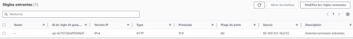

**Synthèse de l’objectif général**  

L’objectif est d'obtenir une infrastructure composée d’un Load Balancer, d’un Target Group et de deux instances EC2 (de type webserver) sur lesquelles la charge est répartie. Le tout doit être sécurisé avec des Security Groups correctement configurés.

Partie 1 : Création d'un Load Balancer (LB)

1. Créer un Target Group “FAD-TargetGroup”. Par la suite, vous ajouterez les instances EC2 dans ce Target Group

   Définition Target Group : Un Target Group dans AWS est un ensemble de ressources (comme des serveurs ou conteneurs) vers lesquelles un Load Balancer envoie le trafic.

   Pour la création du Target Group, il faut se rendre dans le service **EC2**. Ensuite, sur le menu de gauche dans la section **équilibrage de charge** sélectionner **Groupes cibles**. 


Dans l’interface **Groupes cibles**, veuillez cliquer sur **Créer un groupe cible**. 


Ensuite, dans la section **Configuration de base**, choisissez le type de cible **Instances** et, dans la partie **Nom du groupe cible**, saisissez **FAD-TargetGroup**. 


**Note** : J’ai conservé le reste de la configuration par défaut et je n’ai pas encore ajouté les instances, car pour le moment, je ne les ai pas encore créées.

Ci-dessous, le Target Group créé : 


2. Créer un Load Balancer “FAD\_LoadBalancer” de type Application Load Balancer qui utilise le Target Group créé précédemment

   Définition Load Balancer de type Application : Un Application Load Balancer (ALB) dans AWS répartit le trafic entrant vers différentes cibles en fonction du contenu des 

   requêtes, en opérant sur la couche 7 (couche application).

   Pour créer le Load Balancer, toujours dans le service **EC2**, sur le menu de gauche, rendez-vous dans la section **Équilibrage de charge** et cliquez sur **Équilibreurs de charge**. 


Dans la nouvelle interface qui s’ouvre, veuillez cliquer sur **Créer un équilibreur de charge**  


Comme **Types d’équilibreurs de charges**, veuillez choisir le type **Application Load Balancer** ensuite cliquez sur **Créer**  


Dans la section **Configuration de base**, veuillez renseigner le nom du Load Balancer **FAD-LoadBalancer**, choisissez la méthode **Accessible sur Internet** et le **type d’adresse IP de l’équilibreur de charge** conservez **IPV4** 


Dans la partie **Mappage réseau** veuillez conserver le paramétrage par défaut.

**Note** : J’ai sélectionné les 3 zones de disponibilité (eu-west-1c (euw1-az2), eu-west-1a (euw1-az3), eu-west-1b (euw1-az1)) alors que j’aurais dû sélectionner la ou les zones de 

disponibilité où sont stockées mes instances.

Ci-dessous, le Load Balancer **FAD-LoadBalancer** créé :** 


3. Créer un Security Group “FAD\_SecurityGroup\_LB” et appliquer ce groupe de sécurité sur le Load Balancer créé précédemment

   Définition Security Group : Un Security Group dans AWS est un pare-feu virtuel qui contrôle le trafic entrant et sortant des ressources, comme les instances EC2 et les Load Balancers, en définissant des règles pour autoriser ou bloquer les connexions selon des adresses IP et des ports spécifiques. 

   Pour créer un Security Group, toujours dans le service **EC2**, dans le menu de gauche veuillez-vous rendre dans la section **Réseau et sécurité** ensuite cliquez sur **Groupes de sécurité**  


Sur cette interface, veuillez cliquer sur **Créer un groupe de sécurité**  


Sur la nouvelle interface qui s’affiche, j’ai défini comme **Nom du groupe de sécurité** **FAD\_SecurityGroup\_LB** pour la description j’ai saisi “**Autorise connexions entrantes**”, et j’ai conservé le VPC par défaut. 


Pour créer une règle entrante, veuillez cliquer sur **Ajouter une règle**  


Pour la règle entrante j’ai défini une règle permettant au Load Balancer de recevoir du trafic HTTP (port 80) uniquement depuis l'adresse IP **85.169.101.162**  

Pour la règle sortante, j’ai conservé la règle par défaut qui permet au **Load Balancer** d'envoyer du trafic vers n'importe quelle adresse IP sur Internet


Une fois la règle définie veuillez cliquer sur **Créer un groupe de sécurité**. 

Ci-dessous le résultat de la création du Security Group **FAD\_SecurityGroup\_LB** qui sera appliqué au Load Balancer.** 




Partie 2 : Création d’une Amazon Machine Image (AMI)

1. Lancer une instance EC2 de base

Pour cette partie, j’ai utilisé une AMI Linux que j’ai nommée  **FAD\_Instance1** sur cette instance j’ai généré une clé que j’ai nommée **FAD\_KeyPair** c’est une clé privée de type **.ppk** car étant sur Windows je prévois d’utiliser  **Putty** pour me connecter sur cette instance. 

Pour réaliser cela, dans le service **EC2** sur le menu de gauche dans la section **Instances** veuillez cliquer sur **Instances** ensuite cliquez sur **Lancer des Instances** 


Sur la nouvelle interface, j’ai saisi le nom de l’instance  **FAD\_Instance1**  et sélectionné l’**AMI Amazon Linux 2023**  


Dans la section **Paire de clés (connexion)** veuillez cliquer sur **Créer une paire de clés**  


Sur cette interface veuillez renseigner les éléments nécessaires nom de la paire de clés **FAD-KeyPair** de Type **RSA**  en format **.ppk** ensuite cliquez sur **Créer une paire de clés****  


**Note** : Cette clé est utilisée pour créer une  **paire de clés** permettant de sécuriser et authentifier l'accès aux instances EC2 via SSH (connexion sécurisée). 

Le type **RSA** désigne l'algorithme de cryptographie asymétrique utilisé pour générer la clé, assurant un haut niveau de sécurité. 

Le format **.ppk** est spécifiquement utilisé par PuTTY, un client SSH sous Windows, pour se connecter aux instances en utilisant la clé privée. Cela garantit que seul l'utilisateur ayant accès à la clé privée peut établir une connexion sécurisée à l'instance EC2.

Lors de la création de cette paire de clés, il est possible de **télécharger la clé privée** (le fichier .pem ou .ppk). La  **clé publique**, quant à elle, est automatiquement stockée par AWS et associée à l'instance EC2 que vous lancez.

Ensuite, j’ai laissé les paramètres par défaut  y compris pour les Security Group qui permet la création par défaut d’une règle autorisant la connexion SSH depuis n’importe quel IP. 

Ensuite, veuillez cliquer sur **Lancer l’instance**. Voici l’instance créée : 


2. **Installer un serveur web** 

Pour installer un serveur web sur cette instance, je me suis connecté en SSH grâce à la Security Group  créer par  défaut précédemment et aussi grâce à la clé privée que j’ai téléchargée  précédemment.  Le  client  SSH  utilisé  est  Putty  car  je  suis  sur  un environnement Windows.  

Voici les étapes à suivre pour se connecter en SSH à l’instance **FAD\_Instance1** via Putty : 

Dans l’onglet  **Session** pour la partie  **Host Name (or IP adresse)**, saisissez l’adresse **IP publique** de votre instance et le **port** associé  


Pour saisir la clé privée sur Putty veuillez suivre ce chemin **Connection** – **SSH** – **Auth** pour accéder à l’onglet **Credentials**. Ensuite, dans **Private key file for authentication** veuillez sélectionnez votre clé privée. 


Une fois la clé saisie, veuillez-vous rendre dans la partie **Session** puis cliquez sur **Open**.  

Une fois connecté sur l’instance, j’ai exécuté les commandes renseigner dans le TP pour installer Apache HTTP Server :   

sudo yum update -y

sudo yum install-y httpd  sudo systemctl start httpd sudo systemctl enable httpd

3. Créer un script pour récupérer et afficher les métadonnées

Pour réaliser cela, comme indiqué dans le TP, j’ai  créé le fichier **metadata.sh** dans le répertoire **/var/www/html/** et y ai inséré ce contenu : 

```bash
#!/bin/bash

TOKEN=$(curl-X PUT[ "http://169.254.169.254/latest/api/token" ](http://169.254.169.254/latest/api/token)

-H "X-aws-ec2-metadata-token-ttl-seconds: 21600")  

curl-H  "X-aws-ec2-metadata-token:  $TOKEN" ht[tp://169.254.169.254/latest/meta - data/instance-id > ](http://169.254.169.254/latest/meta-data/instance-id)

/var/www/html/index.html
```

Pour rendre le script exécutable j’ai utilisé cette commande renseigner dans le TP : **sudo chmod +x /var/www/html/metadata.sh**

Pour vérifier que le script fonctionne, j’ai exécuté manuellement le scripte en utilisant cette commande : **sudo crontab –l** 

Ensuite, je suis allé vérifier dans le fichier index.html en utilisant cette commande **cat /var/ www/html/index.html** et j’ai bien l’id de mon instance qui apparaît 


4. Automatiser l'exécution du script au démarrage

Pour automatiser l’exécution du script au démarrage, il est nécessaire d’installer le package **cronie** pour cela, veuillez exécuter cette commande : **sudo yum install cronie -y** 

Ensuite,  veuillez  démarrer  le  service  cron  en  exécutant  cette  commande  :  **sudo systemctl start crond** 

Via cette commande **sudo systemctl enable crond** veuillez activer le service cron pour qu’il se lance au démarrage  

Enfin, veuillez éditer le fichier de configuration crontab  en utilisant cette commande **sudo crontab –e** et y ajoutez la ligne suivante : **@reboot /var/www/html/metadata.sh**

Grâce à cette configuration le scripte **metadata.sh** s’exécutera à chaque démarrage de l’instance **FAD\_Instance1** 

5. Créer une AMI personnalisée 

Définition AMI : Une **AMI (Amazon Machine Image)** est une image préconfigurée qui contient le système d'exploitation, les applications, et les configurations nécessaires pour lancer une ou plusieurs instances EC2. 

Pour réaliser cela, veuillez sélectionner votre instance **FAD\_Instance1** ensuite veuillez cliquer sur **Action** – **Image et modèles** - **Créer une image**  


Sur l’interface suivante, veuillez saisir le nom de l’image dans mon cas j’ai saisi **FAD\_Instance2** mais le nom correct aurait dû être **FAD\_AMI\_SRVWEB1** ensuite cliquez sur **Créer une image**. 


Voici l’image une fois créée :  


Partie 3 : Création de la première instance EC2 et configuration des security groups

1. **Créer  un Security  Group  “FAD\_SecurityGroup\_EC2” et  ajouter votre  instance créée précédemment à ce Security Group**

   Les règles devront être les suivantes : 

   ● SSH (port22) : Autorisez l'accès SSH depuis votre adresse IP publique (l’IP Ynov, pour connaitre votre IP Publique vous pouvez utiliser : ht[tps://ifconfig.me) ](https://ifconfig.me/)

   ●HTTP (port 80) : Autorisez uniquement le trafic provenant du load balancer (sélectionnez le security group du load balancer comme source).

   Pour la création du Security Group, veuillez suivre les mêmes étapes que le point 3 de la partie 1. 

   Ensuite, veuillez ajouter les 2 règles entrantes spécifiées ci-dessus. 

   Voici le résultat : 

   La règle entrante qui a été surlignée est celle qui permet de recevoir le trafic HTTP sur le port 80 provenant du Security Group **FAD\_SecurityGroup\_LB**, qui est associé au Load Balancer. 

   Le Security Group **FAD\_SecurityGroup\_EC2** sera associé à l’instance EC2 que je créerai. Ainsi, le Load Balancer sera la seule ressource autorisée à se connecter à l’instance EC2 via le port 80 en HTTP. 


2. Créer une instance EC2 “FAD\_Instance1” qui utilise le Security Group “FAD\_SecurityGroup\_EC2” et l’AMI créée précédemment. Le type de l’instance doit obligatoirement être t2.micro

   Pour créer une instance EC2 à partir de l’AMI créée précédemment, voici les étapes à suivre : 

   Dans le service **EC2**, dans la partie **Instances**, cliquez sur **Lancer des Instances**. 

   Sur cette interface, saisissez le nom de votre instance **FAD\_Instance1**, et dans la section **Mes AMI**, cliquez sur **M’appartenant**, puis dans la partie **Amazon Machine Image (AMI)**, sélectionnez votre image **FAD\_Instance2**. 


Le type d’instance est une t2.micro la **Paire de clés (connexion)** est celle créée précédemment **FAD\_KeyPair** 

Pour les Paramètres réseau, j’ai conservé ceux par défaut, excepté pour le Security Group. Pour cette instance, j’ai ajouté le Security Group **FAD\_SecurityGroup\_EC2**  


Voici l’instance crée : 


3. Vérifier qu’en utilisant l’adresse de votre LoadBalancer dans un navigateur, vous accédez bien au serveur web et aux métadonnées de votre instance EC2

   Sur un navigateur, en utilisant le nom DNS de mon Load Balancer j’accède bien à mon instance :  


Voici le schéma du Load Balancer :  


Partie 4 : Installation de l'AWS CLI et ajout d’une seconde instance

1. Installer et configurer l’AWS CLI sur votre ordinateur

Pour installer AWS CLI sur un ordinateur Windows, veuillez saisir cette ligne de commande sur un terminal : **msiexec.exe /i https://awscli.amazonaws.com/AWSCLIV2.msi**

Une fois AWS CLI installé, veuillez-vous rendre dans le service IAM sur AWS pour créer votre access key ce qui vous permettra de vous connecter sur AWS en mode CLI via un terminal. 

Une fois l’access key créée, il faudra copier l’**Access key** et le **Secret access key** 


Pour se connecter sur AWS en mode CLI, veuillez utiliser un terminal (CMD par exemple) et utiliser cette commande : **aws configure** 

Ensuite, veuillez renseigner les informations demandées.


Pour vérifier si je suis bien connecté, j’ai lancé cette commande :  

```bash
aws  ec2  describe-instances  --filters  "Name=tag:Name,Values=FAD\_Instance1"  -- query "Reservations[\*].Instances[\*].InstanceId" --output text 
```
Note : Cette commande permet de lister l'**ID** de l'instance EC2 qui a le tag **Name** avec la valeur **FAD\_Instance1**, en affichant uniquement l'ID dans un format simple (texte).

La commande m’a bien affiché l’id de mon instance  **FAD\_Instance1** donc je suis bien connecté. 


2. Utiliser l’AWS CLI pour créer une seconde instance similaire à la première nommée “FAD\_Instance 2” 

   Pour réaliser cela, je vais créer une instance en utilisant l’AMI que j’ai créé. Pour cela, veuillez lister les AMI disponibles afin de sélectionner l’id de votre AMI. Pour cela, j’ai utilisé cette commande qui me permet de lister les AMI : **aws ec2 describe-images -- owners self --query "Images[\*].[ImageId,Name]" --output table** 


Mon image **FAD\_Instance2** apparait, je vais donc utiliser cette id d’image pour lancer mon instance voici la commande

```bash
aws ec2 run-instances --image-id ami-04c6bed27bedb4073 --instance-type t2.micro --key-name FAD-KeyPair --security-group-ids sg-0b3b830f14c501f5c --subnet-id subnet-0655f72c900baddc5 --tag-specifications "ResourceType=instance,Tags=[{Key=Name,Value=FAD\_Instance3}]" --count 1
```

Cette commande lance une nouvelle instance EC2 de type **t2.micro** en utilisant l’image AMI spécifiée (**ami-04c6bed27bedb4073**). Elle associe l’instance à la clé **FAD-KeyPair**, au  groupe  de  sécurité  **sg-0b3b830f14c501f5c**,  et  au  sous-réseau  **subnet - 0655f72c900baddc5**. L’instance est étiquetée avec le tag  **Name : FAD\_Instance3**, et une seule instance est lancée.

Voici une partie du résultat obtenu sur CMD après avoir saisi cette commande pour créer ma nouvelle instance : 


Dans mon cas, j’ai nommé mon instance **FAD\_Instance3** 

Pour vérifier le statut de mon instance et obtenir son adresse ip voici la commande  que j’ai saisie :  

```bash
aws  ec2  describe-instances  --filters  "Name=tag:Name,Values=FAD\_Instance3"  -- query "Reservations[\*].Instances[\*].[InstanceId,State.Name,PublicIpAddress]"  -- output table 
```


Voici mon instance en mode graphique :


**Note** : Pour lancer cette commande, il faut avoir les ID de l’image, du groupe de sécurité 

et du subnet. Il faut aussi avoir  le nom de la clé privée et du type d’instance  que l’on souhaite lancer. 

Commande pour lister les groupes de sécurité : 
```bash
aws ec2 describe-security-groups --query "SecurityGroups[\*].[GroupId, GroupName, VpcId, Description]" --output table 
```
Commande pour lister les sous réseaux :
```bash
aws ec2 describe-subnets --query "Subnets[\*].[SubnetId, VpcId, AvailabilityZone, CidrBlock]" --output table 
```
3. Utiliser l’AWS CLI pour ajouter cette instance au Target Group créé dans la partie 1 du TP 

   Pour ajouter l’instance  **FAD\_Instance3** dans le Target Group **FAD-TargetGroup,** il faut  obtenir l’arn du Target Group  **FAD-TargetGroup** et l’id de l’instance que je dois ajouter dans ce Target Group. 

   Pour obtenir ces informations, voici la commande à utiliser pour obtenir l’ARN du Target Group : 
```bash
aws  elbv2  describe-target-groups  --names  "FAD-TargetGroup"  --query "TargetGroups[0].TargetGroupArn" --output text 
```


ID du Target Group : arn:aws:elasticloadbalancing:eu-west - 1:149028371915:targetgroup/FAD-TargetGroup/2ddeeff61ac6c81a

Pour avoir l’id de l’instance :
```bash
aws  ec2  describe-instances  --filters  "Name=tag:Name,Values=FAD\_Instance3"  -- query "Reservations[\*].Instances[\*].[InstanceId]" --output text 
```


ID de l’instance : i-09c8782cb8be91f81 

Pour ajouter l’instance **FAD\_Instance3** dans le Target Group **FAD-TargetGroup** voici la commande a utilisé :**  
```bash
aws elbv2 register-targets  --target-group-arn arn:aws:elasticloadbalancing:eu-west - 1:149028371915:targetgroup/FAD-TargetGroup/2ddeeff61ac6c81a  --targets  Id=i - 09c8782cb8be91f81  
```
Voici le résultat après l’ajout   


4. En utilisant l’adresse de votre Load Balancer, en rafraîchissant et en supprimant le cache de votre navigateur (ou en utilisant le mode privé du navigateur), vous devez observer la répartition de vos requêtes s’opérer. 


Le Load Balancer fonctionne car une fois sur deux je tombe soit sur ma première instance, soit sur la seconde.  

Voici le schéma final : 


