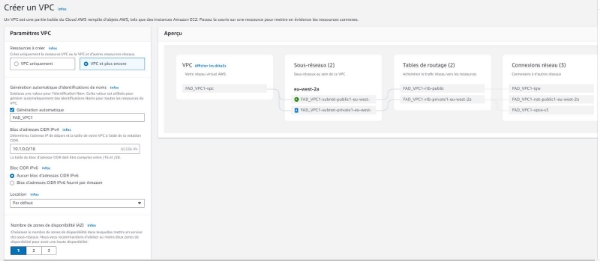
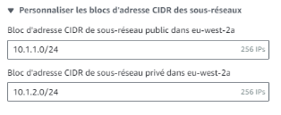
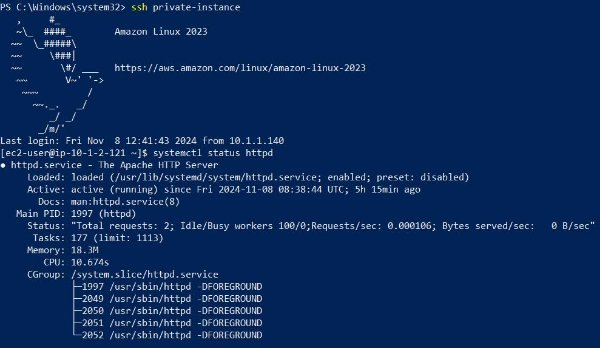

TP 2- Réseau AWS - Création et appairage de 2 VPCs

Synthèse de l’objectif général 

Dans cet exercice, vous allez créer deux Virtual Private Clouds (VPC) distincts, chacun contenant une instance EC2 sur un sous réseau . Ces deux instances seront les bastions pour se connecter aux instances privées des VPC.

Initialement, ces VPC, et leurs instances dans les réseaux privés, seront isolés l'un de l'autre.  Vous  configurerez  ensuite  une  connexion  de  peering  entre  les  deux  VPC  et mettrez  en  place  des  règles  de  sécurité  permettant  aux  instances  privées  de communiquer entre elles uniquement via le protocole HTTP (port 80).

Note : Pour cet exercice, je suis en binôme avec  **Loïc** et nous sommes dans la région **Londre eu-west-2**  

Schéma réseau de ce qui est attendu

Partie 1 : Création des VPCs 

Pour commencer, nous allons créer un VPC pour chaque membre du binôme en respectant le tableau de sous réseaux suivant :  

|Nom du VPC |VPC CIDR |` `Subnet |Private Subnet |
| - | - | - | - |
|FAD\_VPC1 |10\.1.0.0 /16 |10\.1.1.0 /24 |10\.1.2.0 /24 |
|LLT\_VPC2 |10\.111.0.0 /16 |10\.111.1.0 /24 |10\.111.2.0 /24 |

Lors de la création, sélectionner une seule zone de disponibilité et ajouter une NAT Gateway 

Pour la création du VPC, j’ai choisi l’option **vpc et plus encore** puis j’ai choisi un **réseau**  et un **sous réseau privé** et une **zone de disponibilité**. 

Dans  la  partie  **personnaliser  les  blocs  d’adresse  CIDR  des  sous  réseaux**,  j’ai renseigné le sous réseau **10.1.1.0 /24** pour le réseau public et **10.1.2.0 /24** pour le réseau privé et ensuite j’ai cliqué sur **Créer VPC**.  

Voici le résultat final 

Partie 2 : Création des instances et des bastions

1. Créer deux instances FAD\_InstanceVPC1 et FAD\_InstanceVPC2 (une dans chaque VPC sur le sous-réseau privé). Utiliser une AMI avec Apache HTTPD d’actif (cf TP1) pour gagner du temps par la suite 

   Pour réaliser cela, je vais créer une instance **FAD\_InstanceVPC1** à partir de l’image **AMI** que j’ai créée dans le précédent TP. 

   Mon AMI est dans une autre région, donc j’ai copié cette AMI dans ma nouvelle région. 

Ensuite, j’ai créé une nouvelle paire de clé **FAD\_KeyPair\_VPC1** de type .ppk car j’utilise PuTTY pour la connexion  SSH : 

Pour lancer mon Instance EC2 **FAD\_InstanceVPC1**, veuillez cliquer sur **Lancer des instances**  

Sur la nouvelle interface, j’ai saisi le nom de mon Instance **FAD\_InstanceVPC1**, sélectionner l’AMI **FAD\_Instance2** 

J’ai renseigné la clé **FAD\_KeyPair\_VPC1**,** le type d’instance c’est une **t2.micro** 

Au niveau du réseau, j’ai spécifié le  **VPC FAD\_VPC1**, le **sous-réseau privé** et créé un groupe de sécurité **FAD\_GroupSecurity\_VPC1** que j’ai associé à l’instance privée que je configurerai par la suite. 

Ensuite, veuillez cliquer sur **Lancer l’instance** 

2. Créer  deux  autres  instances  FAD\_BastionVPC1  et  TRI\_BastionVPC2  (une  dans chaque VPC sur le sous-réseau public). Ces deux instances possèdent une adresse IP Publique

   Pour la création de l’instance  **Bastion FAD\_BastionVPC1**, j’ai suivi les mêmes étapes que celles effectuées précédemment, à l’exception du fait que, dans le sous-réseau, j’ai spécifié mon  **sous-réseau public**, **activé** **l’attribution automatique de l’adresse IP publique** et créé un groupe de sécurité **FAD\_Bastion\_VPC1**, qui autorise les connexions entrantes en **SSH** vers le Bastion depuis l’adresse IP publique d’Ynov.

Voici l’IP publique du Bastion :  

Règle SSH autorisant la connexion au Bastion :  **FAD\_Bastion\_VPC1** qui sera liée à mon Bastion  

3. Modifier votre configuration du client SSH afin de se connecter aux instances privées en effectuant un rebond sur l’instance publique

   Pour  réaliser  cela,  je  vais  d’abord  créer  un  autre  groupe  de  sécurité  nommé **FAD\_GroupSecurity\_VPC1**,  que  je  vais  lier  à  mon  **instance  privée**.  Ce  groupe contiendra une règle entrante  **autorisant l’accès SSH** depuis mon Bastion vers mon instance privée. 

   Voici le groupe : 

Note : Pour les deux groupes de sécurité, je n’ai pas modifié les règles de sortie. 

Pour la configuration de SSH sur mon appareil, j’ai installé  **OpenSSH** en suivant les indications présentes sur ce lien :  **[https://www.it-connect.fr/installer-et-configurer - openssh-server-sur-windows-server-2019/** ](https://www.it-connect.fr/installer-et-configurer-openssh-server-sur-windows-server-2019/)**

Une fois **OpenSSH** installé, j’ai créé un dossier **.ssh** et un fichier **config** dans le chemin suivant : C:\Users\Admin 

Pour ce TP, j’en ai aussi profité pour déposer ma clé privée FAD\_KeyPair\_VPC1 dans le répertoire suivant : C:\Users\Admin\.ssh 

Dans le fichier de config, voici la configuration que j’ai faite : 

Host bastion

`  `HostName 18.133.245.199 

`  `User ec2-user 

`  `IdentityFile C:/Users/Admin/.ssh/FAD\_KeyPair\_VPC1\_1 

Host private-instance 

`  `HostName 10.1.2.121 

`  `User ec2-user 

`  `IdentityFile C:/Users/Admin/.ssh/FAD\_KeyPair\_VPC1\_1   ProxyJump bastion 

Sur PowerShell, j’ai saisi la commande suivante : **ssh private-instance** 

Cela m’a permis de me connecter à mon instance privée ayant l’adresse IP **10.1.2.121**. 

Revu des règles :  Security Group Bastion :  

Security Group Instance :  

Partie 3 : Appairage des VPCs, Configuration du routage et tests

1. Configurer l’appairage entre vos deux VPCs 

Pour mettre en place une  **connexion d’appairage**, dans le service **VPC**, sur le menu à gauche dans la partie **Cloud privé virtuel**, veuillez cliquer sur **Connexions d’appairage**. 

Ensuite, cliquez sur **Créer une connexion d’appairage** 

Ci-dessous, la configuration que j’ai saisie :  

Ensuite,  cliquez  sur  **Créer  une  connexion  d’appairage** Après création du **VPC\_Peering**  

Mon collègue a reçu la demande et l’a acceptée :  

2. Mettre à jour les tables de routage pour que les adresses du CIDR du subnet privé du VPC 1 soit accessible depuis le subnet privé du VPC 2 et inversement 

   Après avoir mis en place la connexion d’appairage, il me reste à renseigner le sous - réseau privé de mon collègue dans ma table de routage privée pour finaliser cette partie 

   de l’appairage. 

   Pour  ce  faire,  dans  l’interface  **Connexion  d’appairage**,  dans  la  section  **Table  de routage**, j’ai sélectionné cette table **rtb-08122a2f24213cece / FAD\_VPC1-rtb-private1- eu-west-2a**, et j’y ai saisi le sous-réseau privé de mon collègue **10.111.2.0 /24**. 

   Ci-dessous la connexion d’appairage :

Ci-dessous, la table de routage privée que j’ai modifiée : 

3. Si nécessaire, modifier les groupes de sécurité pour permettre aux instances de communiquer entre elles sur le port 80

   Dans le groupe de sécurité lié à mon instance privée  **FAD\_GroupSecurity\_VPC1**, j’ai autorisé la connexion **HTTP** sur le port **80** pour tout le monde (j’ai laissé l’accès ouvert à 

   tout le monde car je suis dans un réseau privé, donc seul mon collègue, en dehors de 

   moi, pourra établir une connexion HTTP avec mon instance privée).

   Dans ce groupe de sécurité **FAD\_GroupSecurity\_VPC1**, j’ai aussi **autorisé** le ping pour que mon collègue puisse confirmer qu’il atteint bien mon instance privée. Cette règle est 

   la première qui s’affiche dans le groupe de sécurité, et j’ai uniquement spécifié son sous - réseau privé **10.111.2.0/24**. 

4. Valider que les connexions HTTP  sont  possibles en  se connectant  en  SSH  sur l’instance privé du VPC 1 (avec un rebond sur le bastion) et faire une requête sur l’IP de l’instance  privée  du  VPC  2  (et  inversement)

   En me connectant sur mon Instance privé, j’arrive  à joindre l’instance privé de mon collègue (car il a  appliqué les règles d’autorisation ICMP pour le ping et aussi pour le HTTP) 

La requête HTTP à l’instance privée de mon collègue (**10.111.2.245**) depuis mon instance privée (**10.1.2.121**) a **fonctionné** avec succès. 

